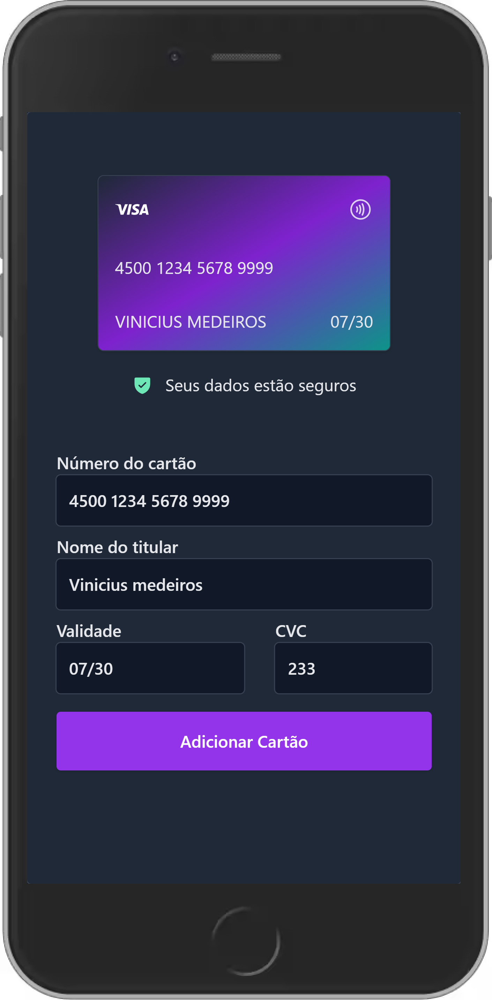

# # Boas vindas ao repositório do Credit-Card.

Este é uma mini projeto desenvolvido durante uma mentoria da **Trybe**  em Julho de 2023. A aplicação constitui em um formulario para preenchimento de cartão de crédito. A idéia de estilização veio do desafio #boraCodar-13 da **Rocketseat** e pode ser acessado aqui! [aqui!](https://www.rocketseat.com.br/boracodar/desafios-anteriores/um-forms-de-cartao-de-credito-desafio-13)

## Descrição

O objetivo deste projeto é criar um formulário de preenchimento de cartão de crédito que seja intuitivo e agradável visualmente. O formulário permite que os usuários insiram as informações de seus cartões de crédito de forma segura e rápida.

## Stacks utilizadas

- React
- TypeScript
- Tailwind CSS

## Agradecimentos
- Trybe (https://www.betrybe.com.br) - Pela mentoria e suporte durante o desenvolvimento do projeto.
- Rocketseat (https://rocketseat.com.br) - Pelo desafio #boraCodar-13 que inspirou a estilização do formulário.

## Demonstração

Acessar: [Clique Aqui](https://vmedeiros-credit-card.vercel.app/)

  

